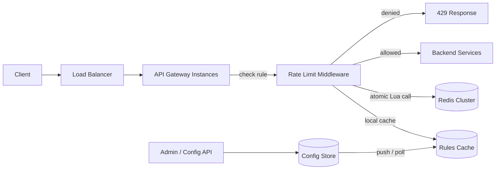

# Design: Distributed Rate Limiter

> A low-latency, distributed rate limiting service that protects APIs from abuse and overload by enforcing per-client request quotas across many stateless gateway instances.

**Status:** Draft | **Author:** <your name> | **Last updated:** <date>

---

## 1. Problem Statement

Our API is served by many stateless gateway instances behind a load balancer. Without limits, a single misbehaving or malicious client can exhaust capacity and degrade service for everyone. We need a rate limiter that enforces quotas consistently across all instances, adds minimal latency to each request, and degrades gracefully when its own dependencies fail.

**Out of scope:**
- DDoS mitigation at the network layer (handled by CDN/WAF)
- Billing-grade usage metering (requires exact, durable counts)
- Per-user business quotas that reset monthly (a separate quota service)

## 2. Requirements

### Functional
- Limit requests per identity (API key, user ID, or IP) per endpoint or endpoint group.
- Support multiple rules per request (e.g. 100/sec burst and 10,000/hour sustained).
- Return clear responses to callers: `429 Too Many Requests` with `Retry-After`, plus `X-RateLimit-Limit`, `X-RateLimit-Remaining`, and `X-RateLimit-Reset` headers.
- Rules are configurable at runtime without redeploying.
- Support allowing short bursts while enforcing a steady average rate.

### Non-functional
| Concern | Target |
|---|---|
| Availability | 99.99% (the limiter must never be the reason the API is down) |
| Latency | p99 < 2 ms added per request |
| Throughput | 150k checks/sec peak |
| Accuracy | Within ~1-5% of the configured limit under normal operation |
| Consistency | Eventual is acceptable across regions; strong per key within a region |
| Failure behavior | Fail open by default, fail closed for sensitive endpoints (configurable) |

## 3. Capacity Estimates

Assumptions:
- 10,000 active API clients, 5M distinct active identities (including per-IP limits)
- Average 50k requests/sec, peak 150k requests/sec across the fleet
- Each request triggers 1-2 rule checks

Derived:
- **Check rate:** ~150k-300k checks/sec at peak.
- **State per key:** token bucket needs two values (token count, last refill timestamp), roughly 100 bytes including key overhead.
- **Memory:** 5M keys x ~100 B = ~500 MB, plus overhead, so ~1 GB. This fits comfortably in memory.
- **Redis throughput:** one Redis node handles roughly 80-100k simple ops/sec. At 300k/sec we need at least 4 shards, so we plan for 6-8 for headroom.
- **Network:** each check is a ~100-200 byte round trip, so ~60 MB/sec at peak, which is fine within a datacenter.

Conclusion: state fits in memory, but throughput requires horizontal sharding by key.

## 4. High-Level Architecture



**Request flow:**
1. The gateway receives a request and extracts the identity (API key, user ID, or IP) and the endpoint.
2. Middleware looks up the matching rules from a local in-memory cache (refreshed from the config store every ~30 seconds).
3. For each rule, it computes the Redis key (e.g. `rl:{api_key}:{rule_id}`) and runs an atomic Lua script that refills and consumes tokens.
4. If every rule allows the request, it proceeds to the backend. Otherwise the gateway returns `429` with the most restrictive `Retry-After`.

The limiter runs as middleware inside the gateway rather than as a separate network hop. This saves a round trip and keeps latency low, at the cost of coupling the limiter library to the gateway.

## 5. API Design

### Internal check interface

```text
check(identity, rule_id, cost=1) -> { allowed: bool, remaining: int, reset_after_ms: int }
```

`cost` lets expensive endpoints consume more than one token.

### Response to clients

```http
HTTP/1.1 429 Too Many Requests
Retry-After: 3
X-RateLimit-Limit: 100
X-RateLimit-Remaining: 0
X-RateLimit-Reset: 1767225600
Content-Type: application/json

{ "error": "rate_limited", "message": "Too many requests. Retry in 3 seconds." }
```

### Admin API for rules

```http
PUT    /admin/v1/rules/{rule_id}
GET    /admin/v1/rules
DELETE /admin/v1/rules/{rule_id}
```

Example rule:

```json
{
  "rule_id": "search-per-key",
  "match": { "endpoint": "/v1/search", "identity": "api_key" },
  "algorithm": "token_bucket",
  "capacity": 100,
  "refill_per_sec": 20,
  "on_store_failure": "fail_open"
}
```

## 6. Data Model

| Entity | Key fields | Storage | Why |
|---|---|---|---|
| Rule | rule_id, match, algorithm, capacity, refill_per_sec, failure_mode | Postgres (source of truth), cached in gateway memory | Low volume, needs durability and audit history |
| Bucket state | key = `rl:{identity}:{rule_id}`; fields: `tokens`, `ts` | Redis Cluster (hash per key) | Needs atomic ops and sub-millisecond latency |

- **Sharding:** Redis Cluster hashes by key, so one identity's state always lives on one shard. We use a hash tag (`rl:{identity}:...`) so all rules for one identity land on the same shard.
- **TTL:** each key expires shortly after it would be fully refilled (`capacity / refill_per_sec` plus a small buffer). Idle clients cost no memory.

## 7. Deep Dives

### 7.1 Choosing the algorithm

| Algorithm | How it works | Pros | Cons |
|---|---|---|---|
| Fixed window counter | Counter per time window | Simplest, cheapest | Boundary burst: up to 2x the limit across a window edge |
| Sliding window log | Store a timestamp per request | Exact | Memory grows with request rate; expensive |
| Sliding window counter | Weighted blend of current and previous window | Cheap, smooth, approximate | Assumes even distribution within the window |
| **Token bucket** | Tokens refill at a steady rate; each request spends tokens | Allows controlled bursts, tiny state, easy to explain | Needs atomic read-modify-write |
| Leaky bucket | Requests drain at a fixed rate through a queue | Smooths output | Adds queuing delay; poor fit for APIs that should reject quickly |

**Decision:** token bucket as the default. It models what API consumers expect (a burst allowance plus a sustained rate) and needs only two values per key. Sliding window counter is offered as an option for rules where burstiness must be tightly bounded.

### 7.2 Atomicity under concurrency

A naive read-then-write from many gateway instances creates a race: two requests read the same token count and both succeed. We avoid this by running the whole refill-and-consume step as a single Lua script inside Redis, which executes atomically.

```lua
-- KEYS[1] = bucket key
-- ARGV[1] = capacity, ARGV[2] = refill per sec, ARGV[3] = now (ms), ARGV[4] = cost
local capacity = tonumber(ARGV[1])
local refill   = tonumber(ARGV[2])
local now      = tonumber(ARGV[3])
local cost     = tonumber(ARGV[4])

local data   = redis.call('HMGET', KEYS[1], 'tokens', 'ts')
local tokens = tonumber(data[1]) or capacity
local ts     = tonumber(data[2]) or now

local elapsed = math.max(0, now - ts)
tokens = math.min(capacity, tokens + (elapsed / 1000) * refill)

local allowed = 0
if tokens >= cost then
  tokens = tokens - cost
  allowed = 1
end

redis.call('HSET', KEYS[1], 'tokens', tokens, 'ts', now)
redis.call('PEXPIRE', KEYS[1], math.ceil((capacity / refill) * 1000) + 1000)

return { allowed, math.floor(tokens) }
```

**Clock source:** passing `now` from the gateway risks clock skew between instances. Better: use Redis server time (`redis.call('TIME')`) inside the script so all instances share one clock per shard. (Redis 5+ allows this safely in scripts.)

### 7.3 Reducing load on Redis

At 300k checks/sec, Redis is the bottleneck. Options considered:

- **Local token pre-fetch (batching):** each gateway instance reserves a small chunk of tokens (e.g. 10) from Redis and serves requests locally until the chunk is spent. This cuts Redis calls by up to 10x for hot keys, at the cost of slight over-admission (bounded by chunk size x number of instances).
- **Local pre-filter for obvious abusers:** keep a short-lived local deny list for keys that were just rejected, so repeated hammering is rejected without touching Redis.

**Decision:** start without batching (simpler, more accurate). Add chunked pre-fetch only for keys whose request rate exceeds a threshold.

## 8. Trade-offs and Alternatives Considered

| Decision | Chosen | Alternatives | Why chosen | What we give up |
|---|---|---|---|---|
| Algorithm | Token bucket | Fixed window, sliding window | Burst-friendly, minimal state | Slightly harder to reason about than a simple counter |
| State store | Redis Cluster | In-process counters, DynamoDB, Memcached | Atomic scripts, sub-ms latency, TTLs | Another stateful dependency to operate |
| Placement | Middleware in gateway | Standalone limiter service, sidecar | No extra network hop | Library must be kept in sync across gateways |
| Counting scope | Global per key (single source of truth) | Per-instance limits (limit / N) | Accurate limits regardless of load balancing | Every check needs a network call |
| Failure policy | Fail open (default) | Fail closed | Availability of the API matters more than strict limiting for most endpoints | Brief window with no protection during Redis outage |
| Time source | Redis server time | Gateway clocks | Avoids cross-instance skew | Slightly more complex script |
| Accuracy | Approximate under multi-region | Strict global consistency | Cross-region coordination would add tens of ms | A client could exceed limits briefly by spreading across regions |

## 9. Failure Modes and Resilience

| Failure | Impact | Mitigation |
|---|---|---|
| A Redis shard is down | Checks for keys on that shard fail | Replica promotion via Redis Cluster; meanwhile apply per-rule failure policy (fail open by default); short timeout (~5 ms) with a circuit breaker so slow Redis does not slow the API |
| Redis latency spike | Added latency on every request | Strict client timeouts; circuit breaker trips to fail-open or a local fallback limiter |
| Local fallback needed | No shared state available | Each gateway applies a conservative in-memory limiter (limit divided by expected instance count) |
| Hot key (one client floods one shard) | Single shard overloaded | Local deny cache for rejected keys; optional token pre-fetch for hot keys |
| Bad rule pushed | Legitimate traffic blocked | Rules versioned in Postgres, validated on write, staged rollout, instant rollback |
| Config store unavailable | Rules cannot refresh | Gateways keep serving with last known rules from local cache |
| Clock skew | Incorrect refill amounts | Use Redis server time, not gateway time |
| Retry storms after 429s | Clients retry immediately, amplifying load | `Retry-After` header, documentation recommending exponential backoff with jitter |

## 10. Observability and Operations

- **Metrics:** allowed vs. denied count (per rule and per endpoint), check latency p50/p99, Redis error and timeout rate, circuit breaker state, local cache hit rate, number of fail-open events.
- **Logging:** sample denied requests with identity and rule ID (avoid logging every allow). Never log raw API keys; log a hashed identifier.
- **Tracing:** add the rate limit decision as a span attribute on request traces.
- **Alerts:**
  - Redis error rate or circuit breaker open for more than 1 minute
  - Sudden spike in denied traffic (possible attack or a bad rule)
  - Fail-open events on endpoints marked as sensitive
- **Rollout:** new rules ship in shadow mode first (evaluate and log, but do not enforce), then enforce for a small percentage of traffic, then fully.

## 11. Security and Privacy

- Identity extraction happens after authentication where possible, so unauthenticated floods fall back to per-IP limits, which are looser and more shared.
- Consider IPv6 /64 prefixes (not single addresses) as the IP identity to prevent trivial evasion.
- Admin API requires authentication, authorization, and an audit log of rule changes.
- Redis traffic is encrypted in transit and access-controlled; keys use hashed identities, so no raw credentials are stored.

## 12. Scaling: What Changes at 10x?

- **Redis throughput becomes the limit first.** Add shards, and enable token pre-fetch (chunking) for hot keys to cut call volume substantially.
- **Multi-region:** deploy a limiter state store per region with region-local limits, and sync usage asynchronously for global caps. Accept slight over-admission rather than paying cross-region latency on every request.
- **Rule complexity:** if the rule count grows large, compile rules into an indexed structure instead of linear matching.
- **Move toward a sidecar or dedicated service** if multiple gateway technologies need the same logic, so there is one implementation to maintain.

## 13. Future Work

- Adaptive limits that tighten automatically under backend load (load shedding tied to service health).
- Priority tiers so paid or critical traffic is dropped last.
- Concurrency limits (max in-flight requests per client), complementing request-rate limits.
- Dashboards for customers showing their own usage against limits.

## 14. Implementation (optional)

A small working prototype demonstrates the design:

- Repo / folder: `./implementation`
- Stack: <your language/framework>, Redis, Docker Compose
- How to run: `docker compose up`
- Load test: <tool, e.g. k6 or wrk>, with results such as p99 latency added per request, accuracy of enforced limit at different concurrency levels, and behavior when Redis is stopped mid-test

---

### References
- Stripe engineering: "Scaling your API with rate limiters"
- Redis documentation: Lua scripting and Redis Cluster
- IETF draft: RateLimit header fields for HTTP
